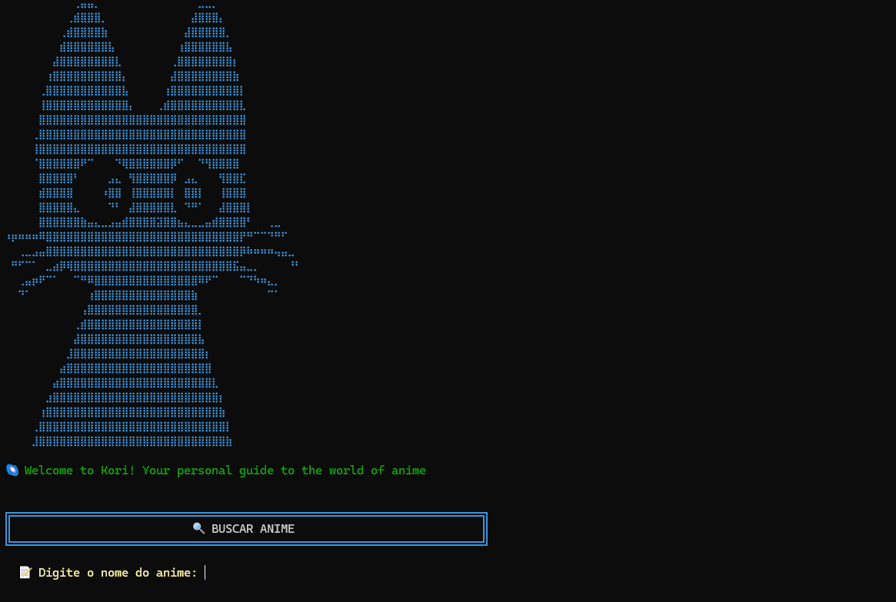

# 🌌 Kori
Kori is an anime recommendation system written in Python, built using the TF-IDF (Term Frequency-Inverse Document Frequency) algorithm.

  <figure style="flex: 1 1 280px; max-width: 250px; margin: 0;">
    
  </figure>
  

---
### 📁 Project Structure

- `/src`: Main source code of the recommendation system (all core logic and modules)
- `/docs`: Project documentation (including LaTeX files and generated PDFs)

---
### ✨ Features
- Recommends anime titles based on user input and content similarity
- Utilizes TF-IDF for text vectorization and similarity calculation
- Integrated search system using external APIs for up-to-date anime information
- Allows users to view episodes info of the selected anime
- Modular and extensible codebase
- Easy to use and adapt for other recommendation tasks
---

### 🧑‍💻 Technologies
- **Httpx**
- **NLTK** 
- **Numpy**
- **Pandas**
---

### 📚 How It Works
1. The system processes a dataset of anime descriptions.
2. Each description is transformed into a TF-IDF vector.
3. When a user search and selects an anime, the system calculates the similarity between the query and all anime in the dataset.
4. The most similar anime are recommended to the user.
---

### 🏫 Academic Context
This project was created for the Linear Algebra course at **FATEC Rubens Lara**. It demonstrates the application of vector spaces and similarity measures in real-world problems.

---
### 🚀 Getting Started
1. Clone this repository
2. Install dependencies (see `pyproject.toml`)
3. Run `main.py` to start the recommendation system

---
### 📄 License
This project is for academic purposes.

